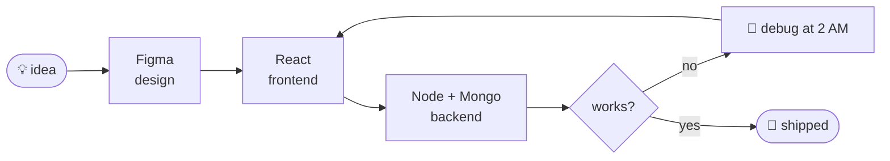

<!-- ═══════════════ HEADER ═══════════════ -->
<div align="center">


<a href="https://github.com/ayyushrk">
  
</a>

<br/>


<br/><br/>


</div>

<h2 align="center">Hi 👋, I'm Ayush</h2>
<p align="center"><i>I design it in Figma, build it in React, and ship it.</i></p>

---

### `$ neofetch --face`

<div align="center">

</div>

---

### `model.py`

```python
import torch.nn as nn

class Ayyush(nn.Module):
    """Sits between code and design. No context switch penalty."""

    def __init__(self):
        super().__init__()
        self.frontend  = ["React", "JavaScript", "HTML", "CSS"]
        self.backend   = ["Node.js", "Express", "MongoDB", "MySQL"]
        self.design    = ["Figma", "Design Systems", "Prototyping"]
        self.learning  = ["PyTorch", "scikit-learn", "LLM apps"]
        self.optimizer = "coffee + football"
        self.dataset   = "real tasks, not tutorials"

    def forward(self, idea):
        ui     = self.design_it(idea)       # Figma tab
        app    = self.build_it(ui)          # React tab
        return self.ship_it(app)            # public track record > certificates

    def debug(self):
        while True:
            self.fix_bug(time="02:00")
            self.play_football(time="06:00")   # never skipped
```

---

### `$ ls checkpoints/`

| project | what it does | stack | link |
|---|---|---|---|
| **Toughness-Aware Exam Scheduler** | Conflict-free exam timetables using graph colouring, a priority queue and a toughness-based stress cost | Python, heapq | [repo](https://github.com/ayyushrk/your-repo-name) |
| **your project 2** | one-line description | React, Node.js, MongoDB | [repo](https://github.com/ayyushrk/your-repo-name) |
| **your project 3** | one-line description | Figma, React | [repo](https://github.com/ayyushrk/your-repo-name) |

<div align="center">
<a href="https://github.com/ayyushrk/your-repo-name">
  
</a>
<a href="https://github.com/ayyushrk/your-repo-name-2">
  
</a>
</div>

---

### `$ ./workflow.sh`



---

### `$ cat requirements.txt`

<div align="center">

</div>

---

### `$ cat status.log`

```text
[now]    training  : regression, SVM, MLP in scikit-learn
[now]    building  : toughness-aware exam scheduler
[next]   exploring : timetable generator for a department
[always] shipping  : real projects, not tutorials
```

---

### `$ htop` &nbsp;·&nbsp; training metrics

<details>
<summary><code>$ expand --all stats</code></summary>

<br/>

<div align="center">


</div>

<div align="center">

</div>

<div align="center">

</div>

<div align="center">

</div>

</details>

---

### `$ tail -f loss.log`

```text
loss
 │
 │ ▇
 │ ▇▆
 │ ▇▇▅
 │ ▇▇▆▄
 │ ▇▇▇▅▃▃
 │ ▇▇▇▆▅▄▃▂▂▁▁▁▁▁▁▁▁▁
 └──────────────────────────► commits
   bugs ↓   rebase fear ↓   2 AM fixes ↑   football ↑
```

---

### `$ ./neural_net.sh`

```text
  INPUT            HIDDEN                OUTPUT

  [idea]  ──┬──►  (figma) ──┬──►  (react)  ──┐
            │               │                ├──►  [ shipped ✓ ]
  [coffee] ─┼──►  (node)  ──┼──►  (mongo)  ──┘
            │               │
  [deadline]┴──►  (git)  ───┴──►  (deploy)
```

---

### `$ snake --eat contributions`

<div align="center">

</div>

---

### `$ ./contact.sh`

<div align="center">

[](https://linkedin.com/in/your-handle)
[](https://instagram.com/your-handle)
[](https://ayushrkumar.vercel.app)

<br/>

> `exit code 0` · open to internships, hackathons and design + dev collaborations.

```bash
$ echo "if it works, don't touch it. if it doesn't, blame the merge conflict."
```


</div>
